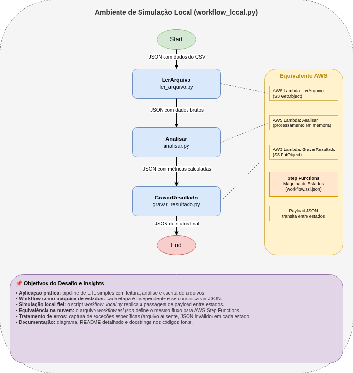

# Desafio: Workflow Automatizado de Processamento de Arquivos

[](https://www.python.org/)
[](LICENSE)

Repositório criado como entrega do desafio **Consolidando Workflows Automatizados com AWS Step Functions** da [DIO](https://www.dio.me/).  
O objetivo é demonstrar a construção de um pipeline que processa e analisa arquivos, aplicando os conceitos de máquina de estados, mesmo em ambiente local.

## 📋 Sobre o desafio

O desafio propõe a consolidação dos conhecimentos adquiridos nas aulas de AWS Step Functions, com ênfase em:

- Aplicação prática em processamento e análise de arquivos.
- Documentação clara e estruturada de processos técnicos.
- Uso do GitHub para compartilhamento de documentação.

A solução apresentada aqui simula localmente um fluxo orquestrado que lê um arquivo CSV, realiza cálculos e gera um relatório, mantendo a correspondência com a sintaxe e o modelo do AWS Step Functions.

## 🧠 Conceitos aplicados

- **Workflow como máquina de estados**: cada etapa é uma tarefa independente que recebe um payload e produz uma saída.
- **Passagem de dados entre estados**: o JSON de saída de uma etapa alimenta a entrada da próxima, exatamente como no Step Functions.
- **Tratamento de erros**: captura de falhas específicas (arquivo ausente, JSON inválido, dados mal formatados).
- **Documentação técnica**: docstrings em todos os módulos, diagrama de arquitetura e README detalhado.

## 🧱 Estrutura do Projeto

```text
desafio-aws-step-functions/
├── lambda/
│   ├── ler_arquivo.py          # Tarefa 1: Leitura do CSV
│   ├── analisar.py             # Tarefa 2: Cálculo de métricas
│   └── gravar_resultado.py     # Tarefa 3: Geração do relatório
├── workflow_local.py           # Orquestrador que executa o workflow localmente
├── workflow.asl.json           # Definição equivalente no formato Amazon States Language
├── vendas.csv                  # Arquivo de entrada (exemplo)
├── resultado.txt               # Arquivo de saída gerado automaticamente
├── images/
│   ├── diagrama_workflow.png   # Imagem exportada do diagrama
│   └── diagrama_workflow.drawio # Arquivo editável do diagrama
├── .gitignore
├── LICENSE
└── README.md
```

## 📊 Diagrama do Workflow



O fluxo possui quatro estados encadeados:

1. **Start** – início da execução.
2. **LerArquivo** – lê `vendas.csv` e emite um JSON com os dados.
3. **Analisar** – calcula o total de vendas e a quantidade de registros.
4. **GravarResultado** – escreve o relatório em `resultado.txt`.
5. **End** – término do workflow.

As setas representam a passagem do payload entre as tarefas. Esse mesmo fluxo é definido formalmente no arquivo `workflow.asl.json`, que seria executado pelo AWS Step Functions em uma implementação na nuvem.

## ⚙️ Como executar localmente

**Pré‑requisitos:** Python 3.8+ instalado.

1. Clone o repositório:

   ```bash
   git clone https://github.com/seu-usuario/desafio-aws-step-functions.git
   cd desafio-aws-step-functions
   ```

2. (Opcional) Crie e ative um ambiente virtual:

   ```bash
   python -m venv venv
   source venv/bin/activate  # Linux/Mac
   venv\Scripts\activate     # Windows
   ```

3. Execute o orquestrador:

   ```bash
   python workflow_local.py
   ```

4. Verifique o relatório gerado:

   ```bash
   cat resultado.txt
   ```

### Exemplo de saída esperada no terminal

```text
--- Executando estado: LerArquivo ---
{"status": "sucesso", "dados": [{...}]}

--- Executando estado: Analisar ---
{"total_vendas": 5239.79, "quantidade_registros": 5}

--- Executando estado: GravarResultado ---
{"status": "sucesso", "arquivo": "resultado.txt"}

Workflow concluído com sucesso! Verifique o resultado em resultado.txt
```

### Personalização

- Para testar com seus próprios dados, edite o arquivo `vendas.csv` mantendo as colunas `produto`, `valor` e `quantidade`.
- O tratamento de erros já está implementado: experimente renomear ou remover `vendas.csv` para ver como o workflow captura a falha.

## ☁️ Mapeamento com AWS Step Functions

Caso o projeto fosse implantado na AWS, cada script da pasta `lambda/` seria uma função AWS Lambda independente. A máquina de estados definida em `workflow.asl.json` as orquestraria exatamente como o script `workflow_local.py` faz localmente.

A definição ASL já está pronta; as funções precisariam ser adaptadas para ler/escrever em um bucket S3 em vez de arquivos locais, mas a lógica permaneceria a mesma.

## 📚 Aprendizados

Durante este desafio, pratiquei:

- Modelagem de workflows com estados encadeados e passagem de payload.
- Boas práticas de código Python: docstrings, tratamento específico de exceções e tipagem implícita.
- Criação de documentação técnica efetiva e visual (diagrama + README).
- Uso do Git/GitHub para versionar e compartilhar um projeto completo.

## 📝 Licença

Este projeto está sob a licença MIT. Veja o arquivo `LICENSE` para mais detalhes.
